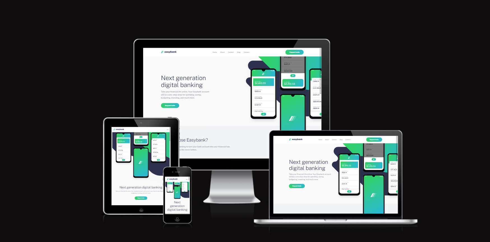

# Frontend Mentor - Easybank landing page solution

This is a solution to the [Easybank landing page challenge on Frontend Mentor](https://www.frontendmentor.io/challenges/easybank-landing-page-WaUhkoDN). Frontend Mentor challenges help you improve your coding skills by building realistic projects.

## Table of contents

- [Overview](#overview)
  - [The challenge](#the-challenge)
  - [Screenshot](#screenshot)
  - [Links](#links)
- [My process](#my-process)
  - [Built with](#built-with)
  - [What I learned](#what-i-learned)
  - [Continued development](#continued-development)
- [Author](#author)

## Overview

### The challenge

Users should be able to:

- View the optimal layout for the site depending on their device's screen size
- See hover states for all interactive elements on the page

### Screenshot

### Links

- Solution URL: [Add solution URL here](https://github.com/OliverCadman/easybank_landing_page)
- Live Site URL: [Add live site URL here](https://olivercadman.github.io/easybank_landing_page/)

## My Process

### Built with

- Semantic HTML5 markup
- CSS custom properties
- Flexbox
- CSS Grid
- Mobile-first workflow
- A bunch of absolute positioning!

### What I learned

I gained a little deeper understanding of absolute positioning, as this technique is leveraged pretty heavily in this project. I learned a little more about Figma also; I hadn't realised until now that you can see the amount of margin between elements in a figma file by clicking on an element, then pressing the alt key and hovering over another element. When you do this, the margin is uncovered in all its glory! This was a great discovery, since I could more accurately replicate the original design (hopefully).

### Continued development

I have always been intrigued and wanted to try out modern responsive techniques such as vmin, vmax, minmax etc... though I'm not sure how to apply them to my project (or really know where to start!). I would like to work these techniques into my toolbox as I am certainly aware that any modern FE developer worth their salt should have a good grasp of these techniques. If anybody has any pointers regarding how to go about methods of thought and application of CSS features such as vmin, vmax and minmax (as well as absolute positioning and transform techniques) I would love to hear from you!

## Author

- LinkedIn - [Find me on LinkedIn](https://www.linkedin.com/in/oliver-cadman/)
- Frontend Mentor - [@OliverCadman](https://www.frontendmentor.io/profile/OliverCadman)
- Instagram - [olisometimes_plays_piano](https://www.instagram.com/olisometimes_plays_piano/)
